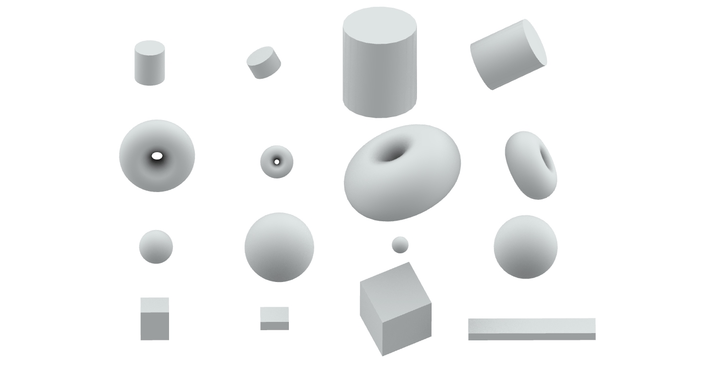

# LibIntrinsic: Intrinsic Shape Analysis & Spectral Geometry

**LibIntrinsic** is a Python library and Grasshopper toolset for analyzing 3D shapes based on their **intrinsic geometry** (how they vibrate) rather than their extrinsic geometry (where they are in space).

It computes **ShapeDNA** (Laplace-Beltrami Eigenvalues) to perform **topological search**, clustering, and analysis that is invariant to rotation, translation, and mesh deformation.


*Demo running on objects from the [COSEG Dataset](https://irc.cs.sdu.edu.cn/~yunhai/public_html/ssl/ssd.htm).*

---

## 🚀 Features

- **Spectral Analysis**  
  Compute mass and stiffness matrices and Laplace-Beltrami eigenvalues (LBO).

- **ShapeDNA**  
  Generate numeric "fingerprints" for 3D objects.

- **Topology Search**  
  Find similar objects (e.g., violins) regardless of position, orientation, or pose.

- **Grasshopper Integration**  
  Native component for Rhino / Grasshopper workflows.

---

## 📦 Installation

### Prerequisites

- Windows (recommended for Rhino / Grasshopper)
- Anaconda or Miniconda

---

### 1. Create the Environment

Open **Anaconda Prompt** and run:

```bash
# Create a fresh environment
conda create -n libintrinsic python=3.10
conda activate libintrinsic

# Install dependencies
pip install numpy scipy scikit-learn trimesh networkx matplotlib pillow
```

---

### 2. Install LibIntrinsic

Clone the repository and install it in editable mode:

```bash
git clone https://github.com/Pouria-Nia/LibIntrinsic.git
cd LibIntrinsic
pip install -e .
```

---

## 🦗 Grasshopper Setup



This library comes with a **Grasshopper User Object**.

1. Navigate to the `grasshopper/` folder in this repository.
2. Drag and drop the `SpectralMatch.ghuser` file onto your Grasshopper canvas.
3. A new tab named **LibIntrinsic** will appear in the toolbar.

---

### Using the Component

The component requires two inputs to locate your Python environment:

- **PythonPath**  
  Full path to your conda Python executable  
  Example:  
  ```
  C:\Users\NAME\.conda\envs\libintrinsic\python.exe
  ```

- **RepoPath**  
  Full path to the cloned repository  
  Example:  
  ```
  C:\Users\NAME\Documents\GitHub\LibIntrinsic
  ```

See `grasshopper/Example_Scene.gh` for a ready-to-use template.

---

## 🖥️ CLI Usage (For Developers)

You can run the search engine directly from the command line, without Rhino.

### Search for Similar Shapes

```bash
python apps/similarity_search.py search \
  -q data/query.obj \
  -d data/database_folder \
  -o results.json
```

---

### Cluster a Folder of Meshes

```bash
python apps/similarity_search.py cluster \
  -i data/my_shapes \
  -o clusters.json \
  -k 3
```

---

## 📚 Citation

If you use this work in academic research, please cite it as follows:

```bibtex
@software{libintrinsic2025,
  author = {Pouria Shahhoseini Nia},
  title = {LibIntrinsic: Spectral Geometry and ShapeDNA for Computational Design},
  year = {2025},
  url = {https://github.com/Pouria-Nia/LibIntrinsic}
}
```

---

## 📄 License

MIT License.  
See the `LICENSE` file for details.
